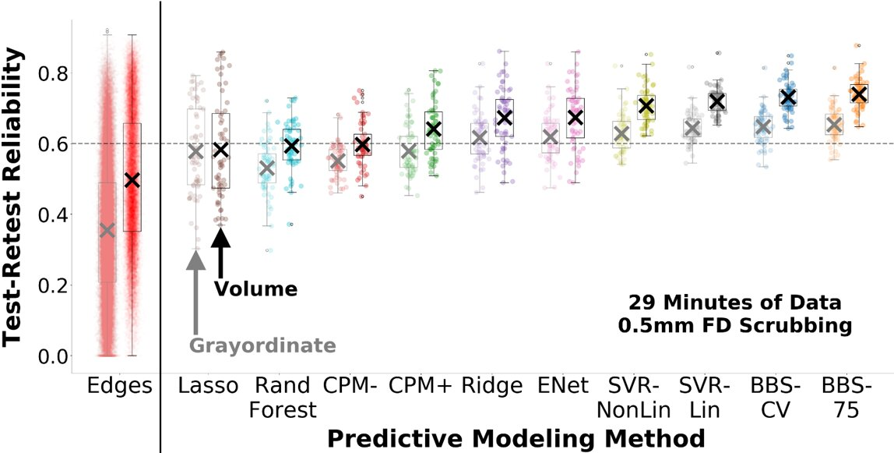

# Predictive Modeling Achieves High Test-Retest Reliability with Resting State Functional Connectivity

### Chandra Sripada, Aman Taxali, Mike Angstadt, Saige Rutherford
#### Department of Psychiatry, University of Michigan, Ann Arbor, MI 

Paper Link: https://www.biorxiv.org/content/10.1101/796714v3

Test-retest reliability is critical for individual differences research. We apply ten predictive modeling methods to resting state connectivity maps from the Human Connectome Project dataset to predict 61 outcome variables. In contrast to reliability of individual resting state connections, we find reliability of the predicted outcomes of predictive models is substantially higher for all ten predictive modeling methods.

### File Descriptions

 * [notebooks](./notebooks)
   * [train_models.ipynb](./notebooks/train_models.ipynb) - Contains the code to train predictive models and save model results (ICC, accuracy, predictions)
   * [visualize_results.ipynb](./notebooks/train_models.ipynb) - Creates visualizations used in the paper, uses saved model results 
 * [saved_models](./saved_models)
   * [cifti/cifti_saved_models.tar.gz](./saved_models/cifti/cifti_saved_models.tar.gz) - tarfile containing outputs of `train_models.ipynb` for grayordinate data
   * [volume/volume_saved_models.tar.gz](./saved_models/volume/volume_saved_models.tar.gz) - tarfile containing outputs of `train_models.ipynb` for volumetric data
   * [edgewise](./saved_models/edgewise) - Directory containing ICC values for raw connectome edges (not a predictive model)
 * [data](./data)
   * [cifti](./data/cifti) Grayordinate FC data, used in `train_models.ipynb` to train predictive models
   * [volume](./data/volume) Volumetric FC data, used in `train_models.ipynb` to train predictive models
   * [folds.pickle](./data/folds.pickle) - Fold indices used for each cross validation step
   * [factors.csv](./data/factors.csv) - General executive and processing speed factors of HCP variables
 * [misc](./misc) - Figures 1, 2 and 3, displayed in readme

### Dependencies

The code provided in this repository was run on the following environment

* python 3.6.6
* numpy 1.17.2
* sciPy 1.3.1
* scikit-learn 0.22.2
* rpy2 2.9.1

---
### Pipeline for calculating test–retest reliability of predicted outcomes

---
### Distribution of test–retest reliabilities for predictive models for volumetric and grayordinate data

---
### Test–retest reliabilities for predicted outcomes across run-lengths and FD thresholds

